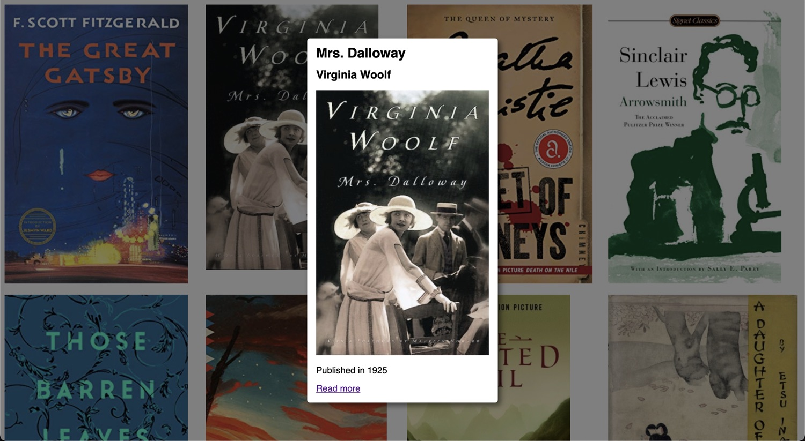
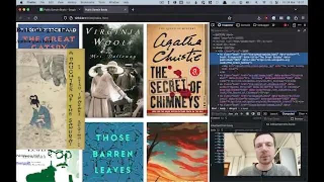

## Dynamic HTML Pop-ups

A simple, easy-to-implement solution for creating dynamic book pop-ups using HTML, JavaScript, and CSS. This repository contains all the necessary code to display detail information in an elegant pop-up window when a user clicks on an item in your collection. No complex libraries or frameworks required!

This example uses public domain books, but you can easily adapt this code to display any type of item in your collection. For example, you could use this code to display information about a museum exhibit, a piece of art, or a historical artifact.

## YouTube

This project is also available as a YouTube tutorial. Click the image below to watch the video.

## Features

- Responsive grid layout for book cover images
- Dynamic pop-up content based on the book's data attributes
- Customizable styles for the pop-up window

## How to Use

- Clone this repository or download the source files.
- Add your collection images to the assets folder.
- Update the index.html file with your item data (title, author, publication date, and Wikipedia link) using the provided data attributes.
- Customize the appearance of the pop-up window in the main.css file.
- Implement additional event listeners or interactivity in the main.js file as desired.

## Dependencies

This project requires no external dependencies. All you need is a modern web browser and a text editor to get started!

## License

This project is licensed under the MIT License. Feel free to use, modify, and distribute this code as you see fit.

## Contributing

Contributions are always welcome! If you have any suggestions, improvements, or bug fixes, please submit a pull request or open an issue on this GitHub repository.

---

✨ Happy coding! ✨